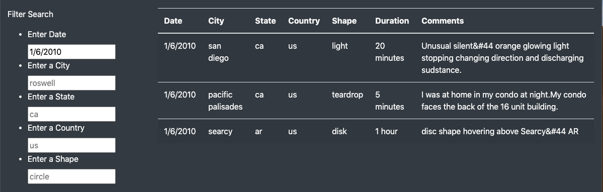
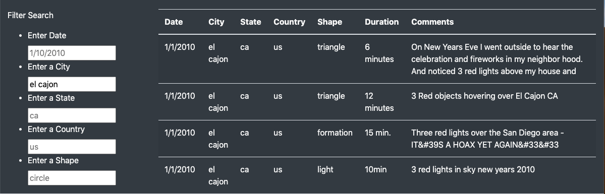
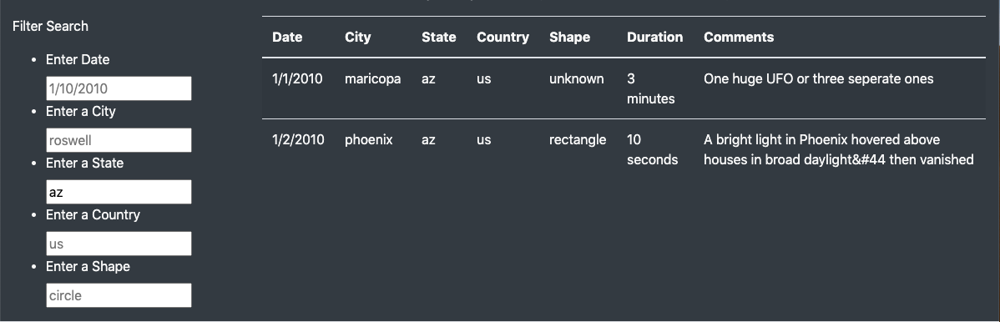
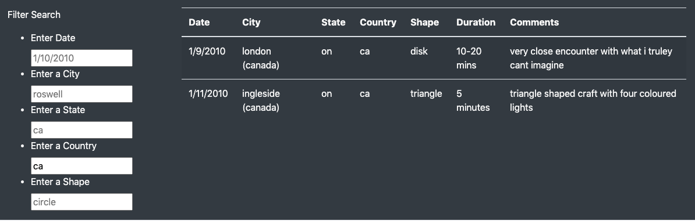
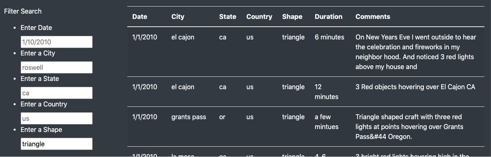
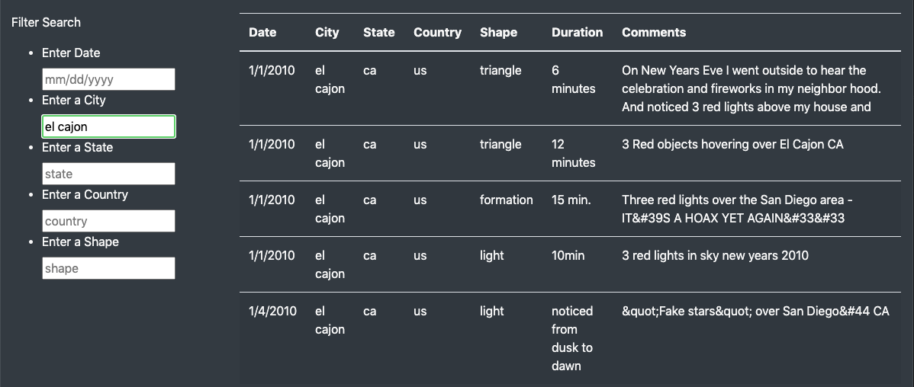
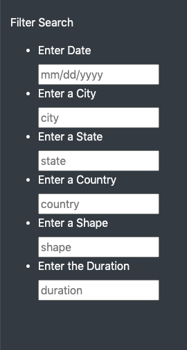

# UFOs

# Overview of Project: 
The purpose of this analysis is to create a visualization for UFO sighting data using HTML and JavaScript.  We were presented with a JavaScript code containing a large amount of data surrounding UFO sightings in various countries, states, cities, with different varietites of sightings.  Our job is to create an HTML code which allows users to easily review the data.  We have also created filters so that users are able to narrow down the data, and view only information which is relevant to their research or exploration.

# Results: 
The UFO Finder webpage is designed to provide users with a simple way of filtering and viewing the UF0 sighting data.  The first option is for the user to filter the data by date of the UFO sighting.  Enter the date you wish to examine and the table will display only sightings from that date:

The second filter option is to filter the data by city:

The third filter option is to filter the data by state.  Keep in mind, if you still have an entry in the city textbox and the city is not in the state that you've added - you will not see any results.  The filters will all apply to the data unless you clear the filters and start over.

The forth filter option is to filter the data by country:

And finally, users have the option to filter the data by the shape of the UFO:

# Summary:
One drawback of the webpage design is that the placeholder text in each filter textbox is visually similar to the text entered by a user.  This can make it difficult to determine if there are multiple filters being applied to the data.  If multiple filters are mistakenly applied, the user would likely exclude the information they wish to see. 

One suggestion to remedy that issue would be to generalize the placeholder text used in the filter textboxes:

Another recommendation for future development would be to add an additional filter for the duration of the sighting: 

